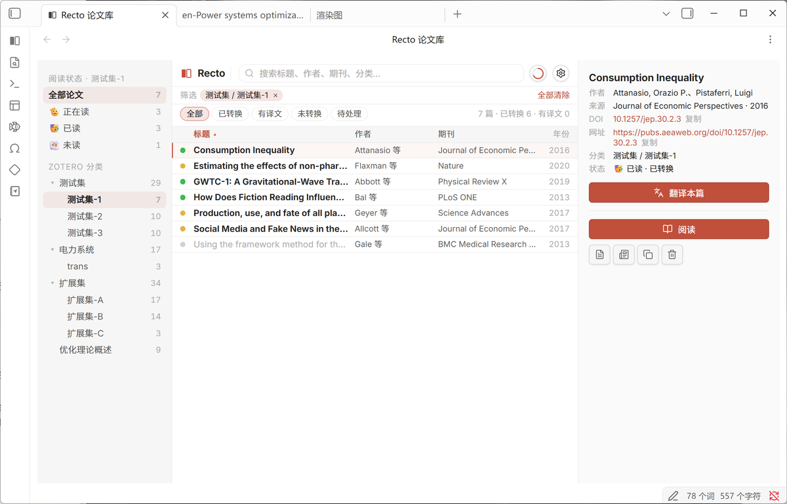
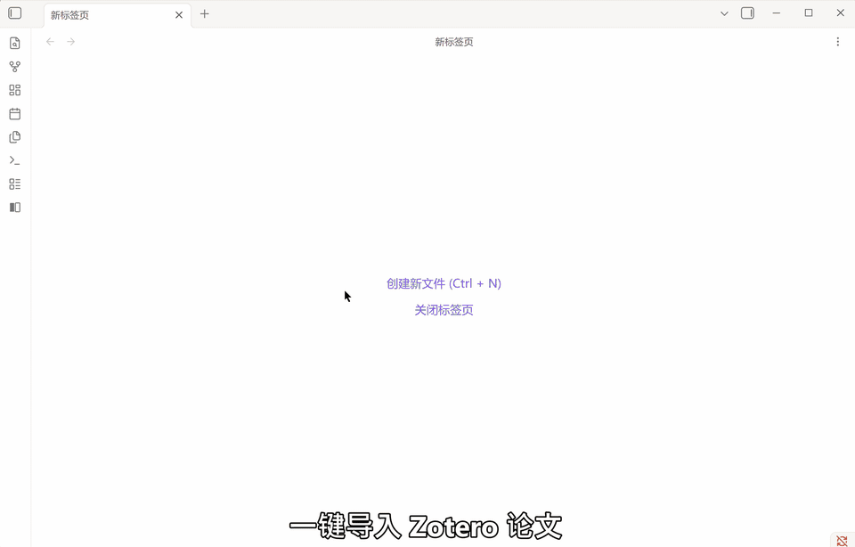
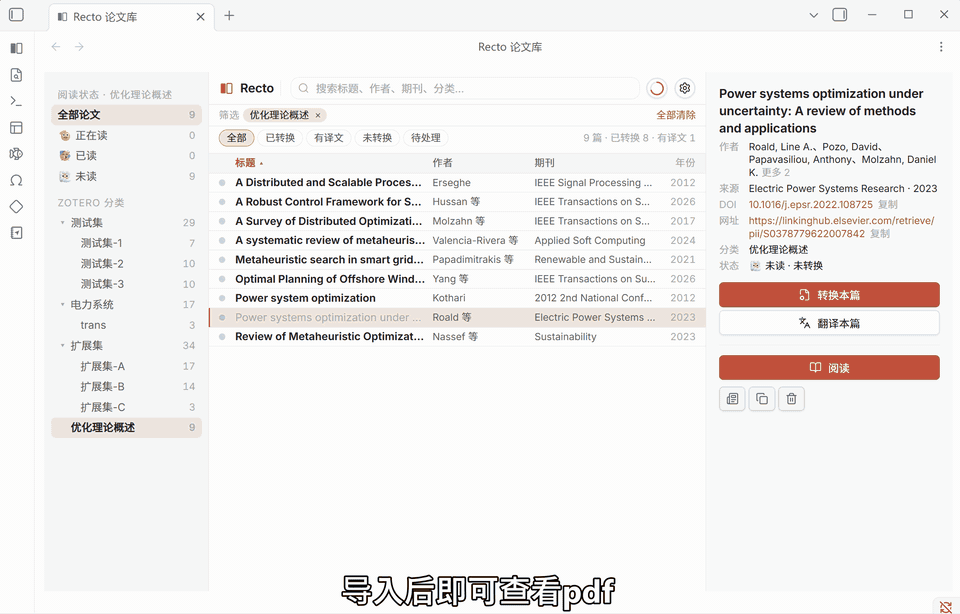
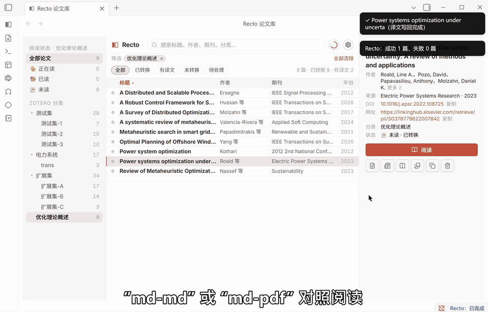
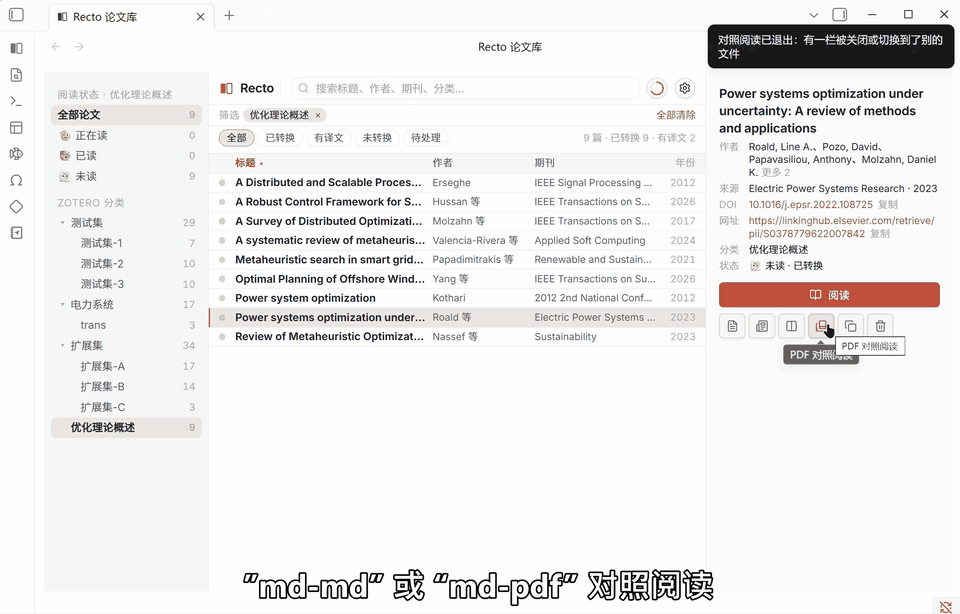
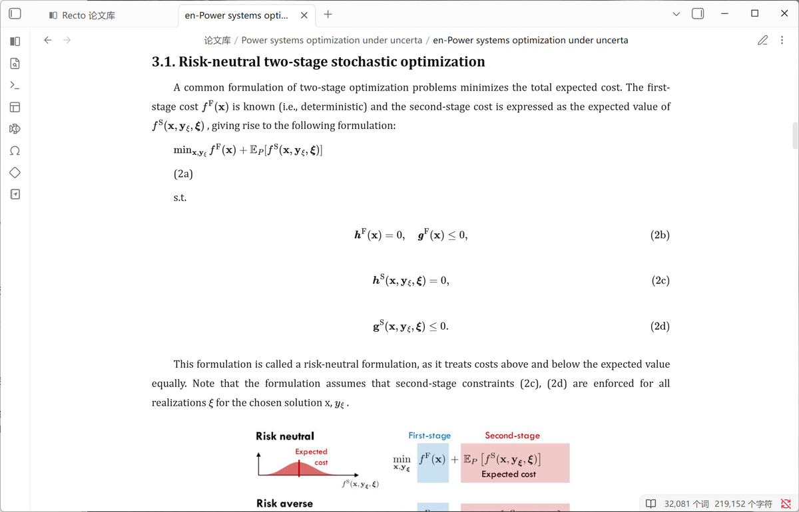
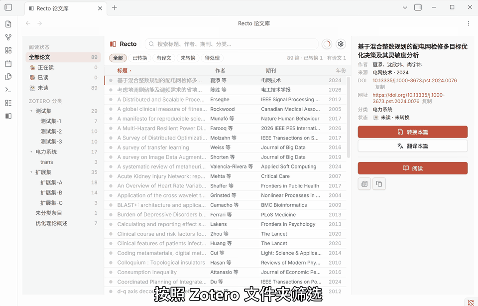
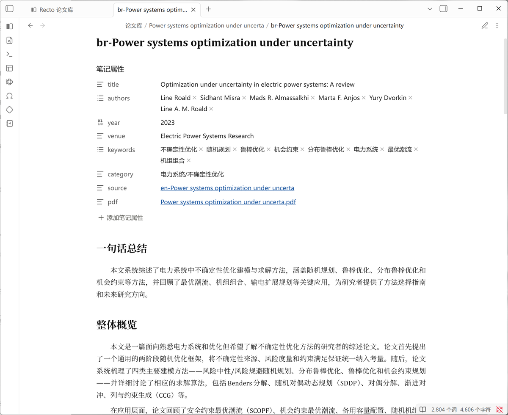

# Recto

**从 Zotero 一键导入论文，自动转为 Markdown，支持中英对照阅读。借助 Obsidian 的双链、搜索与 AI 能力，让读过的论文彼此关联，逐步构建个人知识库。**

## 背景

许多研究者的 Zotero 中积累了数百篇论文，但真正精读的屈指可数。阅读过程中，需要在 PDF 阅读器与翻译工具之间频繁切换；公式与表格经复制后往往格式混乱；已理解的内容散落在浏览器中，事后难以检索、引用，也无法纳入个人笔记体系。

Recto 旨在衔接这一工作流：将论文导入 Obsidian，转换为 Markdown 格式，提供翻译与对照阅读功能，所有产出均存储在本地库中，与既有笔记无缝集成。

## 一键导入 Zotero 文献库

插件自动识别本机 Zotero 应用，将书目元数据与 PDF 附件一并导入，保留原有分类结构。导入后可直接翻阅 PDF；选择目标论文即可发起转换或翻译。

## 双语逐段对照，同步滚动

左侧英文，右侧中文。译文按段落与原文绑定，阅读位置始终保持同步，翻页不会错位。

## 译文与 PDF 原页联动

对某段翻译存疑时，点击该段落，左侧 PDF 即跳转至对应页面并高亮具体区域。公式、图表、页码均可精确定位。

## 公式、表格与插图完整保留

生成的 Markdown 文件中，公式保持可渲染形态并保留编号，插图和表格维持原有位置——非简单将 PDF 提取为纯文本流。

## 文献管理与检索

沿用 Zotero 分类树结构，支持按状态筛选：已转换、有译文、未处理。单篇论文可标记为未读、在读、已读，支持按标题、作者、期刊、分类进行检索。

## 自动生成结构化摘要

转换过程中可同步生成摘要笔记。笔记属性包含标题、作者、年份、期刊、关键词与分类字段，原文与 PDF 以双链形式嵌入——点击即可回溯出处，亦可被 Dataview 等插件作为结构化数据查询。

## 安装

**通过社区插件市场安装**：设置 → 第三方插件 → 浏览 → 搜索 **Recto** → 安装并启用。

**手动安装**：前往 [Releases](https://github.com/jensen-zheng-cmd/Recto-plugin/releases) 下载 `main.js`、`manifest.json`、`styles.css` 三个文件，置于 `<your vault>/.obsidian/plugins/recto/` 目录下，重启 Obsidian 后启用。

## 使用步骤

1. **打开论文库**。启用插件后，左侧边栏出现 Recto 图标，点击即可打开「Recto 论文库」；亦可于命令面板搜索 `打开 Recto 论文库`。
2. **登录**。命令面板执行 `Recto 账号与额度`，注册与登录均在浏览器中完成，完成后自动跳转回 Obsidian。插件内不涉及密码输入。
3. **导入 Zotero**。命令面板执行 `一键导入 Zotero 论文库`，后续过程由插件自动完成。
4. **转换与翻译**。在论文列表中选中目标，右侧详情栏点击「转换本篇」；直接点击「翻译本篇」亦可，未转换的论文会先行转换再翻译。支持多选批量排队处理。
5. **阅读**。点击「阅读」直接查看译文；需对照时，使用详情栏图标中的「原文/译文双栏对照」或「PDF 对照阅读」。

所有文件存储于 vault 的 `论文库/` 路径下，每篇论文对应一个子文件夹：`en-` 为原文，`ch-` 为译文，`br-` 为摘要，PDF 附件亦复制一份于此。

## 使用前提

- **仅支持 Obsidian 桌面端**。需读取本地文件系统，移动端不适用。
- **本机须安装 Zotero**，且目标 PDF 已下载至本地 storage——仅云端存储未落地的附件无法读取。
- **需注册 Recto 账号**（免费）。转换、摘要与翻译均于云端完成，每月提供免费额度，可满足轻度使用需求。
- **界面当前仅提供中文。**

两项已知限制：中文论文不提供翻译功能，插件界面将隐藏翻译入口；对照阅读要求该篇原文与译文均存在，PDF 对照则需译文与 PDF 同时就绪。

## 网络服务说明

转换、摘要与翻译任务均提交至 **Recto 云端服务**（`api.rectoai.uk`）处理：选中 PDF 将上传至服务器，仅执行翻译时上传结构化文本而非原始 PDF；账号与额度管理亦通过同一服务。数据流转方式、留存时长及本地保留范围，详见 **[PRIVACY.md](PRIVACY.md)**。

## 开发说明

本仓库为社区插件市场的发布页面，包含根目录的 `README.md`、`PRIVACY.md`、`LICENSE`、`assets/` 目录及分发所需的三文件，辅以 Release 附件。日常开发于私有主干分支进行，此处仅存放安装与审核相关文件。

## 第三方字体

界面内嵌字体遵循 **SIL Open Font License 1.1** 授权：

- [Inter](https://github.com/rsms/inter)
- [Source Han Sans](https://github.com/adobe-fonts/source-han-sans)（SC 子集，保留字体名 "Source"）
- [JetBrains Mono](https://github.com/JetBrains/JetBrainsMono)

许可原文见 <https://openfontlicense.org>。

## 许可

[MIT](./LICENSE) © 2026 Jensen Zheng

## 作者

Jensen Zheng — GitHub [@jensen-zheng-cmd](https://github.com/jensen-zheng-cmd)