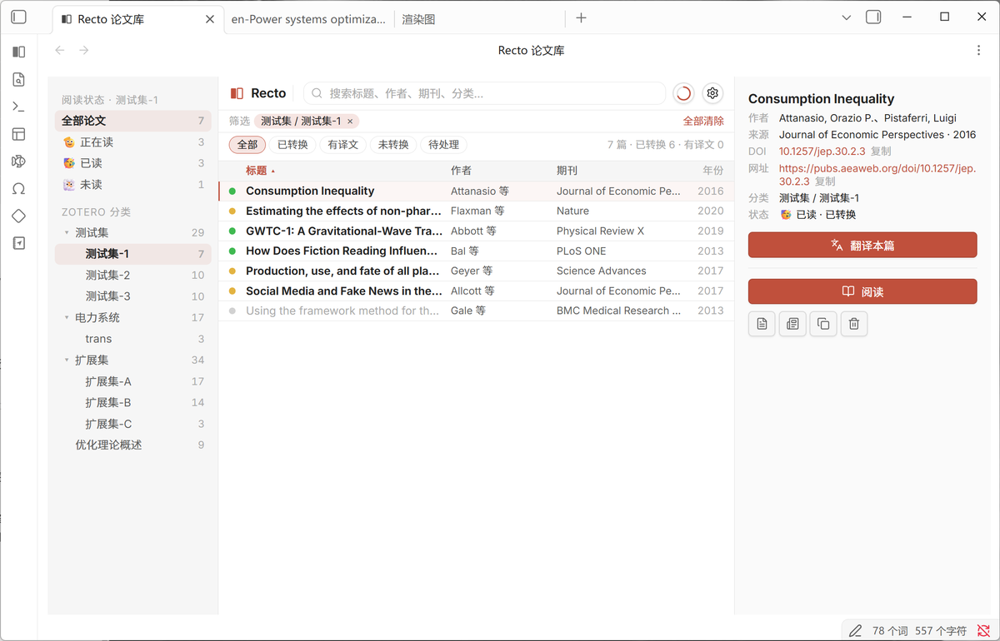
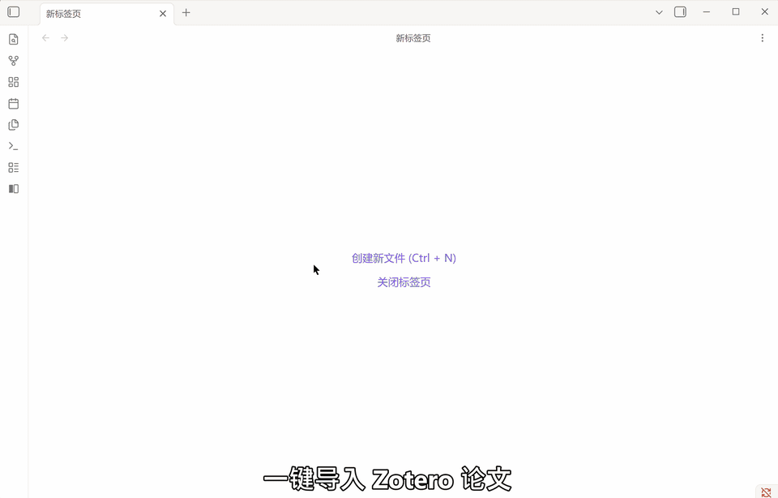
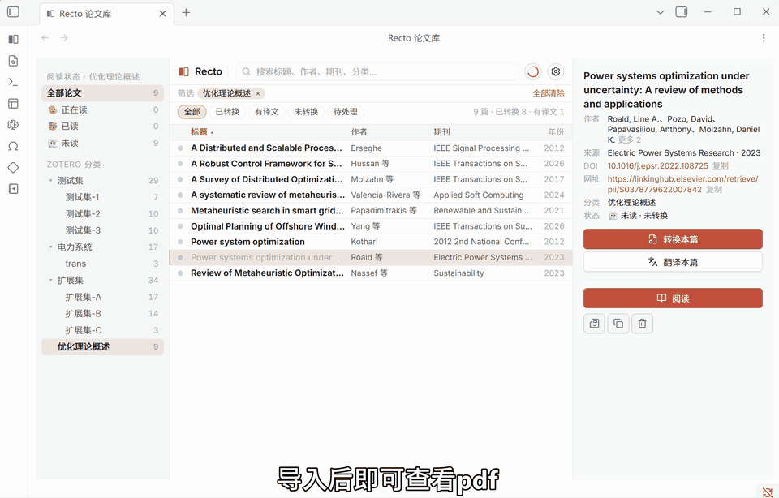
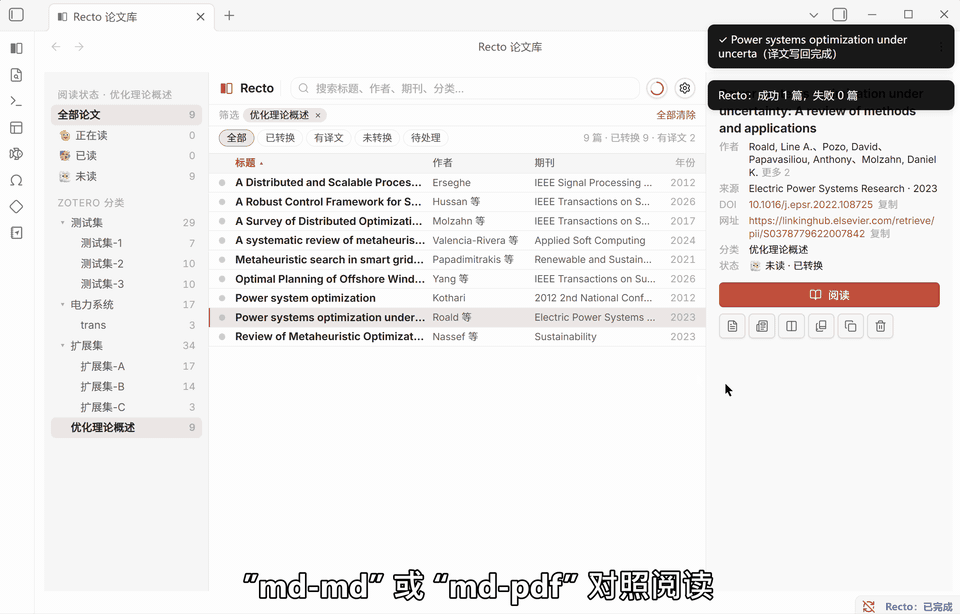
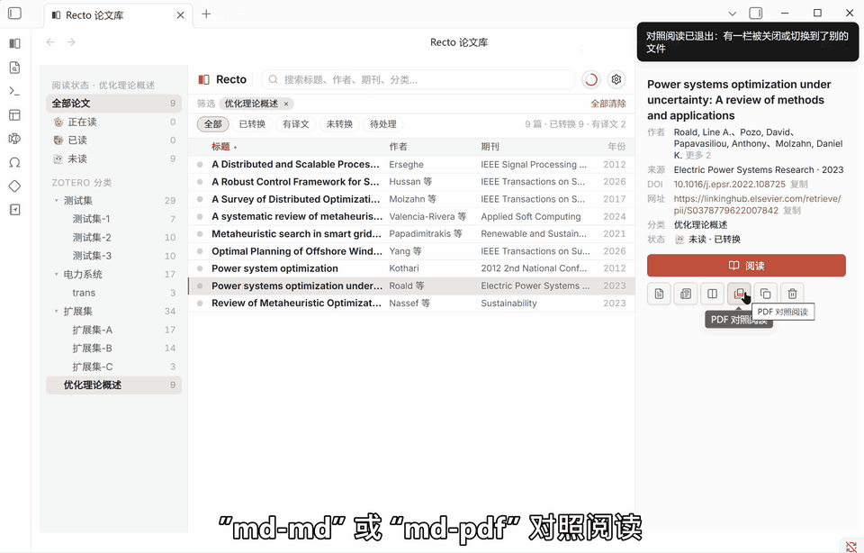
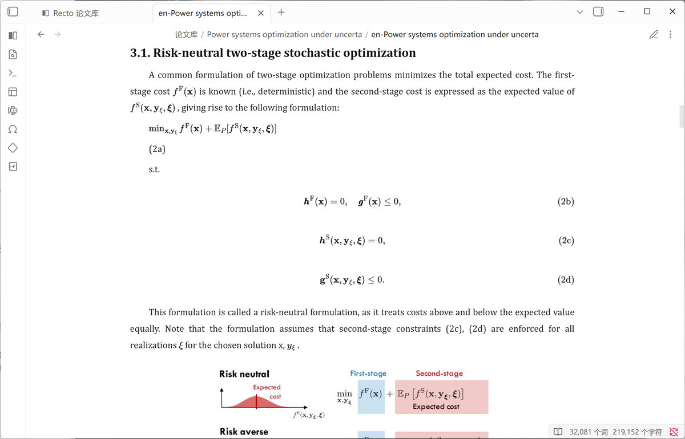
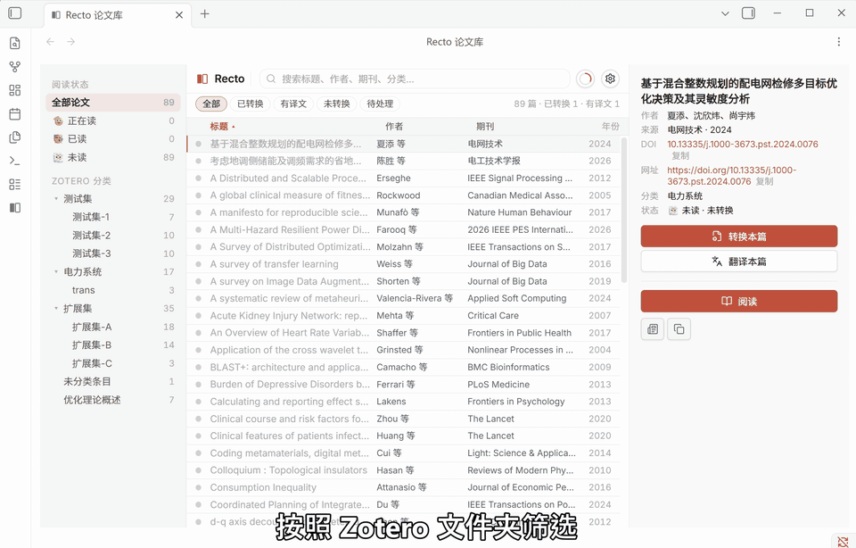
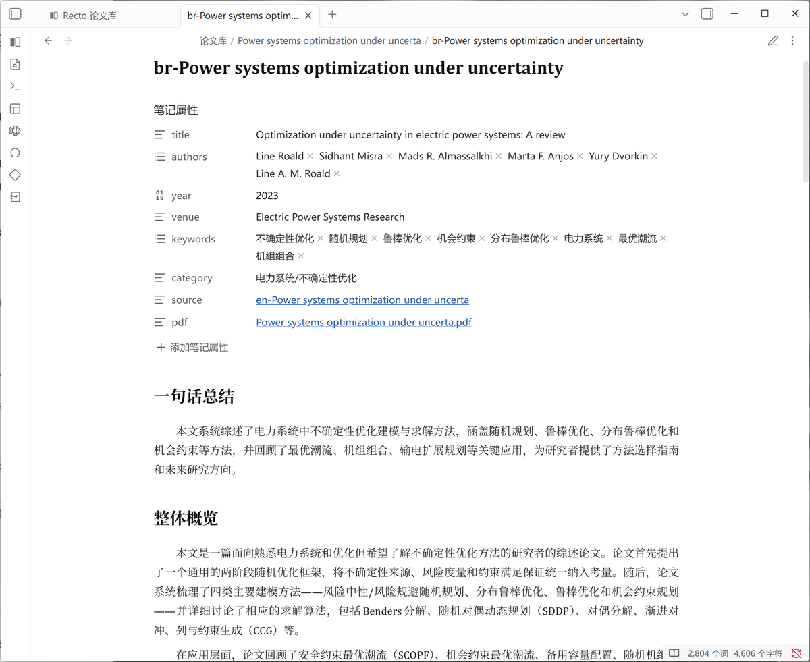

# Zotero PDF OCR and Translation - Recto

**English** | [简体中文](https://github.com/jensen-zheng-cmd/Recto-plugin/blob/main/README.zh-CN.md)

**Bring your Zotero paper library into Obsidian, convert PDFs to Markdown, and read originals alongside translations in your chosen language. Connect papers with your notes through Obsidian's links, search, and AI tools to build a personal knowledge base.**

The screenshots and recordings show the Chinese interface from earlier versions. Recto now supports English and Simplified Chinese; some controls have since changed.

## Background

Many researchers have hundreds of papers in Zotero but have read only a fraction closely. Reading often means switching between a PDF reader and a translation tool. Copied equations and tables lose their formatting, while useful passages remain scattered across browser tabs instead of becoming part of a searchable note collection.

Recto connects this workflow: bring papers into Obsidian, convert them to Markdown, translate them, and read them side by side. Generated files stay in your vault, where they can connect with your existing notes.

## Bring your Zotero paper library into Obsidian

Import bibliographic metadata and locally available PDF attachments together, preserving Zotero's collection hierarchy and papers that belong to multiple collections. Titles, authors, publication details, tags, and other bibliographic fields remain available in the local library. You can browse imported PDFs immediately, then choose which papers to convert or translate.

This brings the paper library's organization and reading workflow into Obsidian. Import reads Zotero without modifying its database or removing its files. It covers bibliographic records associated with imported PDFs, their metadata, and collections; it is not a full backup of every Zotero item type, note, or annotation. Attachments must be available locally. Ambiguous PDF choices are presented for confirmation.

## Read originals and translations side by side

Choose an output language in settings. Translations are linked to the original by paragraph, with synchronized scrolling for comparison. Reading and comparison follow the selected output language; existing files in other languages are preserved.

The interface language and document output language are independent. The interface can follow Obsidian or use English or Simplified Chinese. Document output supports multiple languages, including custom language choices; this does not imply equally reliable OCR for every language or scanned PDF.

## Compare translations with the original PDF

When a passage needs checking, click it in the comparison view to jump to its location in the PDF and highlight the corresponding region. This makes it easier to check wording, equations, and figures against the source page.

## Preserve equations, tables, and illustrations

Conversion produces Markdown with renderable equations, tables, and illustrations, rather than a plain stream of extracted text. Results depend on the source PDF; complex layouts and scans may still need checking against the original.

## Organize and search your papers

Browse the Zotero collection tree, filter papers by processing status, and mark them as unread, reading, or read. Search by title, author, publication, or collection. Subsequent Zotero checks can bring in new papers and refresh collection information without replacing existing reading outputs.

## Generate structured summaries

When translating papers from the library, you can also request a summary and choose its level of detail. The summary follows your output language and is saved as a separate note, with bibliographic properties and links back to the paper. Existing summary files are preserved. Summaries are optional during library translation, not generated automatically by PDF conversion.

## Installation

**Community plugins**: Settings → Community plugins → Browse → search for **Recto** → Install and enable.

**Manual installation**: download `main.js`, `manifest.json`, and `styles.css` from [Releases](https://github.com/jensen-zheng-cmd/Recto-plugin/releases). Place them in `<your vault>/.obsidian/plugins/recto/`, restart Obsidian, and enable the plugin.

## Getting started

1. **Sign in.** Open Recto settings and follow the account link. Registration and sign-in take place in your browser; verify your email and return to Obsidian. Passwords are not entered inside the plugin.
2. **Import Zotero.** Follow the setup steps to locate the local Zotero data directory and import your paper library.
3. **Choose an output language.** Set the language for translations and new summaries independently of the interface language.
4. **Convert and translate.** Select papers in the library and use the detail panel to convert or translate them. Papers without Markdown are converted before translation. Multiple papers can be queued together.
5. **Read and compare.** Use the reading button and its menu to open an available document. The comparison controls open original/translation or PDF comparison views when the required files are ready.

The library lives in your configured vault folder, with a subfolder for each paper. New source Markdown uses `src-`; translated files use a language prefix such as `zh-`, `zht-`, `en-`, or `ja-`; summaries use `br-`. Older `en-` source files and `ch-` translations remain readable.

You can also convert PDFs outside the Zotero library or translate an existing Markdown file. These commands do not require Zotero and save ordinary files in the vault rather than adding entries to the Zotero-based library. The optional summary step applies only to library translation.

## Requirements and service access

- **Obsidian desktop only.** Recto reads the local filesystem; mobile is not supported.
- **Zotero library import requires local PDF attachments.** Cloud-only attachments must be downloaded first. Independent PDF conversion and Markdown translation do not require Zotero.
- **Cloud processing requires a free Recto account and an internet connection.** PDF conversion is currently free. Translation uses page credits; purchased credits do not expire. Any signup or invitation allowance is shown on the account page. An optional summary requested with library translation does not use additional translation pages.
- **Payments currently use WeChat Pay in CNY.** International card checkout and Google sign-in are not yet available. Use email registration and sign-in.
- **Comparison requires matching files.** Original/translation comparison needs both documents; PDF comparison also needs the PDF and its mapping data. For independent PDF conversion, enable the option to retain files for PDF comparison if needed.

## Network services

Conversion, summary, and translation requests go to the **Recto cloud service** (`api.rectoai.uk`). Conversion uploads the selected PDF. Translation uploads structured text; translating an existing Markdown file sends that file's text for processing. Account and credit management also use Recto's service. For data handling, retention, and local storage details, see [Privacy and data](https://github.com/jensen-zheng-cmd/Recto-plugin/blob/main/PRIVACY.md).

## Development

This repository is the Community plugin release surface. It contains the English and Chinese READMEs, privacy notice, license, media assets, and the three plugin distribution files, with installable assets attached to Releases. Development takes place in a separate private repository.

## Third-party fonts

Embedded interface fonts are licensed under the **SIL Open Font License 1.1**:

- [Inter](https://github.com/rsms/inter)
- [Source Han Sans](https://github.com/adobe-fonts/source-han-sans) (SC subset; reserved font name "Source")
- [JetBrains Mono](https://github.com/JetBrains/JetBrainsMono)

License text: [SIL Open Font License](https://openfontlicense.org).

## License

[MIT](https://github.com/jensen-zheng-cmd/Recto-plugin/blob/main/LICENSE) © 2026 Jensen Zheng

## Author

Jensen Zheng — GitHub [@jensen-zheng-cmd](https://github.com/jensen-zheng-cmd)
